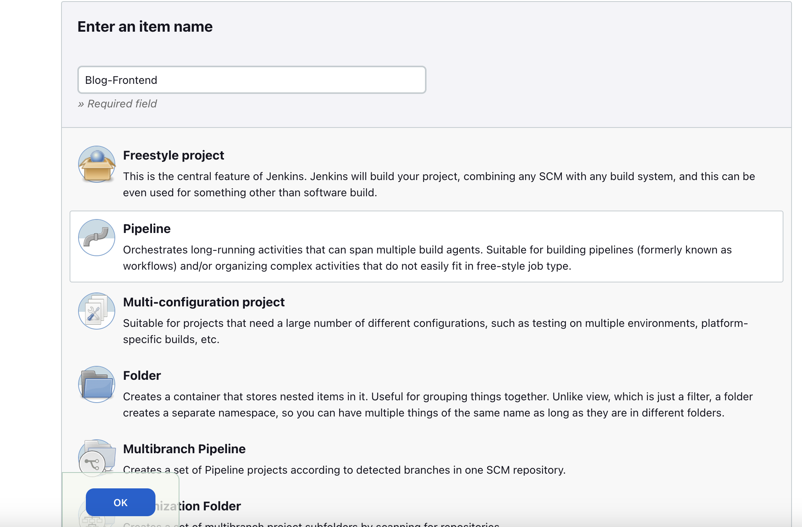

# How to setup VM/VPS with Jenkins, K8s

Loại: Devops, Jenkins, K8s
Lớp: Chuyên môn

## Setup VPS/VM:

1. Create 2 or more VPS/VM with following minimum requirement:
    
    
    |  | Master | Worker1 |
    | --- | --- | --- |
    | Core | 4 | 2 |
    | Ram | 4GB | 4GB |
    | Storage | 20GB+10gb extend | 20GB + 10GB extend |
    | Operation | Ubuntu 20.04+ | Ubuntu 20.04+ |
    | Network IP | 172.16.171.135 (example) | 172.16.171.133 (example) |

## Setup master node:

1. Install some tools in Ubuntu:
    
    ```bash
    sudo apt update
    sudo apt install vim git curl -y
    ```
    
2. Clone setup files and setup K8s for **master node**:
    
    ```bash
    git clone https://github.com/richardktran/infrastructure-setup.git
    cp ~/infrastructure-setup/scripts/master.sh ./master.sh
    cp ~/infrastructure-setup/scripts/common.sh ./common.sh
    cp ~/infrastructure-setup/infrastructure/jenkins/setup.sh ./jenkins-setup.sh
    sudo chmod +x common.sh
    sudo chmod +x master.sh
    sudo chmod +x jenkins-setup.sh
    ```
    
    Run the **common file** to setup Docker, CRI for Docker, Kubeadm, Kubelet and Kubectl:
    
    ```bash
    ./common.sh
    ```
    
    Run the setup-jenkins file to setup jenkins:
    
    ```bash
    ./jenkins-setup.sh
    ```
    
    After run this command, it will show the admin password of Jenkins, access to the **[MasterIP]:8080** to go to the Jenkins dashboard, enter the password to setup Jenkins.
    
    Run the master file to init the master cluster, setup network for k8s
    
    ```bash
    ./master.sh
    ```
    

## Setup worker node:

1. Install some tools in Ubuntu:
    
    ```bash
    sudo apt update
    sudo apt install vim git curl -y
    ```
    
2. Clone setup files and setup K8s for **master node**:
    
    ```bash
    git clone https://github.com/richardktran/infrastructure-setup.git
    cp ~/infrastructure-setup/scripts/node.sh ./node.sh
    cp ~/infrastructure-setup/scripts/common.sh ./common.sh
    sudo chmod +x common.sh
    sudo chmod +x node.sh
    ```
    
    Run the **common file** to setup Docker, CRI for Docker, Kubeadm, Kubelet and Kubectl:
    
    ```bash
    ./common.sh
    ```
    
    Run the master file to init the master cluster, setup network for k8s
    
    ```bash
    ./node.sh
    ```
    
    Copy the join command of master node and run it.
    
    Example:
    
    ```bash
    sudo kubeadm join 172.16.171.135:6443 --token 0piwjz.7tromi63dv28sgfo --discovery-token-ca-cert-hash sha256:ccaf5a2641b14aaa472ef0c53aa8b179ba4e5f550b8c0574f4710268205db11c --cri-socket=unix:///var/run/cri-dockerd.sock
    ```
    
    To see the join command, go to master node and run the following command:
    
    ```bash
    kubeadm token create --print-join-command
    ```
    

## Setup Jenkins

### Create a job

1. Select create job, enter job name and select Pipeline project



1. Scroll down to the pipeline section, select the Pipeline script from SCM option. In the SCM, choose Git and enter the Repository URL ([git@github.com](mailto:git@github.com):richardktran/k8s-infrastructure.git)
    
    
    
2.  We will get the error, add the Credentials by add new credentials, choose **SSH Username with private key,** enter the username and private key.
    1. To get the private key, we have to generate the ssh key in Jenkins user of master node. 
        
        ```bash
        sudo su jenkins
        mkdir .ssh
        cd ~/.ssh
        ssh-keygen -t rsa -b 4096 -C "richardktran.dev@gmail.com"
        cat ~/.ssh/id_rsa.pub
        ```
        
    2. Put info of key to know_hosts
        
        ```bash
        ssh-keyscan -t rsa github.com >> ~/.ssh/known_hosts
        ```
        
    3. Copy content of the id_rsa.pub file and paste to your github, copy content of the id_rsa file and paste to your credential of Jenkins.
        
        
        
    4. The result like this:
        
        
        
3. Change the branch to build is “main” branch. Put the path to the Jenkinsfile in Script Path and click Save.
    
    
    
4. Setup some credential declare on Jenkinsfile.
    - Get docker password from dockerhub
    - Github token get from id_rsa file.


**NOTE**: By default, when build image. Jenkins will use jenkins network with bridge driver, we have to change to host network in Jenkinsfile on the build image stage to be able to access internet.

